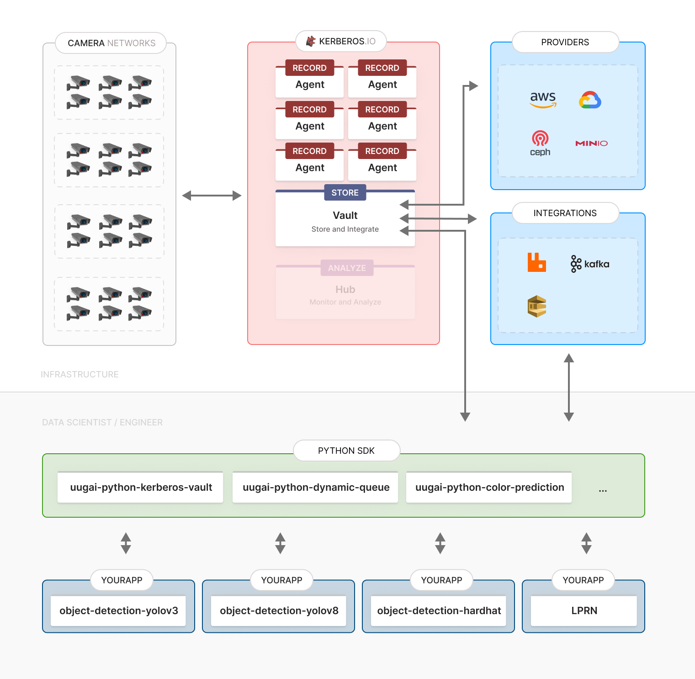

# Example 

This project contains an example that allows developers to retrieve media from a multitude of IP cameras in a scalable matter. This approach allows data scientists, computer vision engineers and/or machine learning experts to focus on their models and abstract the complexity of managing a IP camera network through [Kerberos.io](https://kerberos.io).

An engineer will only need to install a few python models and configure the correct `environment variables` to start retreiving meda and inference with their own customised models.

## The architecture

## Prerequisites

- Kerberos Vault: Have [a look here](https://doc.kerberos.io/vault/first-things-first) for a better understanding of what it's about and how to install.
- Storage provider such as `Minio`, `S3`, `Google Storage`, `Ceph` or other S3 compliant storage.
- Message broker such as `RabbitMQ`, `Kafka`, `SQS` or any other AMQP message broker.

## Let's get started

...

## Install and run

...