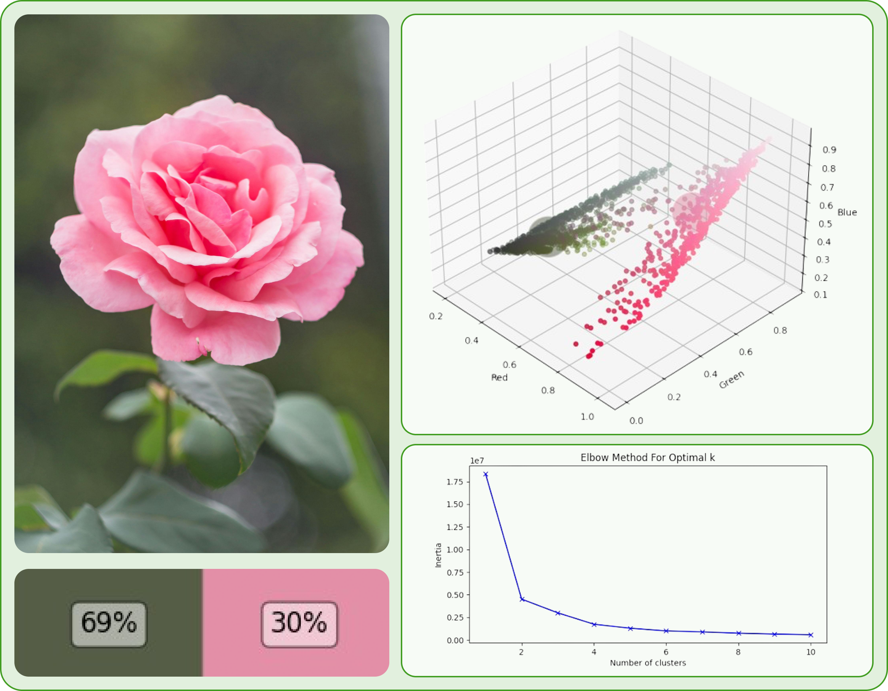

#  Dynamic queueing and Kerberos Vault inference 
This project contains an example that allows developers to retrieve media from a multitude of IP cameras in a scalable matter. This approach allows data scientists, computer vision engineers and/or machine learning experts to focus on their models and abstract the complexity of managing a IP camera network through [Kerberos.io](https://kerberos.io).

An engineer only needs to install a few Python packages and configure the appropriate environment variables to start retrieving media and performing inference with their custom models.

## The architecture
As you can see in following architecture, a network of IP cameras is made available in a specific network. By deploying the Kerberos.io stack: Kerberos Agent(s) and Kerberos Vault, we are able to connect and record (in chunks) the IP camera streams, and store the relevant media on a storage provider of choice.

Once media has been successfully stored (going from Kerberos Agent) into Kerberos Vault, an integration is activated and a message is created in one of the preferred message brokers. This message includes various metadata such as `filename`, `cameraid`, `timestamp` and more.

Specific Python modules are made available, allowing a developer to build their own application and leverage boilerplate code to solely focus on the things that bring business value. The various Python modules simplify fetching messages from one or more queues, retrieving recording from a specific storage provider through Kerberos Vault, and various other computer vision functions and features.


## Prerequisites

- Kerberos Vault: Have [a look here](https://doc.kerberos.io/vault/first-things-first) for a better understanding of what it's about and how to install.
- Storage provider such as `Minio`, `S3`, `Google Storage`, `Ceph` or other S3 compliant storage.
- Message broker such as `RabbitMQ`, `Kafka`, `SQS` or any other AMQP message broker.

## Let's get started
With the above prerequisites in order, you are almost there to start using your custom model(s). 
Firstly install following required Python packages, these provide the symbiosis between the Kerberos Vault, storage provider and message broker.
The packages can also be found on PyPi via these links: 
* [Dynamic queue](https://pypi.org/project/uugai-python-dynamic-queue/)
* [Kerberos Vault implementation](https://pypi.org/project/uugai-python-kerberos-vault/)

In this GitHub repository a requirements.txt file is provided with the example. This includes the listed packages, and others.

     pip install uugai-python-kerberos-vault
     pip install uugai-python-dynamic-queue

or 

     pip install requirements.txt


With the necessary packages installed, they can be imported into your Python file. More information about the usage of these can be found on PyPi or GitHub using:

* Dynamic queue: [PyPi](https://pypi.org/project/uugai-python-dynamic-queue/), [GitHub](https://github.com/uug-ai/uugai-python-dynamic-queue)
* Kerberos Vault implementation: [PyPi](https://pypi.org/project/uugai-python-kerberos-vault/), [GitHub](https://github.com/uug-ai/uugai-python-kerberos-vault)

```Python
from uugai_python_dynamic_queue.MessageBrokers import RabbitMQ          # Or others, which are supported.
from uugai_python_kerberos_vault.KerberosVault import KerberosVault
```

Thereafter it's just a case of initiliazing, utilising with your personal credentials with are read from [the `env` file](https://github.com/uug-ai/example-inference/blob/main/.env).
```Python
# Initialize a message broker using the python_queue_reader package
rabbitmq = RabbitMQ(queue_name = os.getenv('QUEUE_NAME'), 
                    target_queue_name = os.getenv('TARGET_QUEUE_NAME'), 
                    exchange = os.getenv('EXCHANGE'), 
                    host = os.getenv('HOST'), 
                    username = os.getenv('USERNAME'),
                    password = os.getenv('PASSWORD'))

# Initialize Kerberos Vault
kerberos_vault = KerberosVault(storage_uri = os.getenv('STORAGE_URI'),
                               storage_access_key = os.getenv('STORAGE_ACCESS_KEY'),
                               storage_secret_key = os.getenv('STORAGE_SECRET_KEY'))
```

What remains depends on your specific implementation. For instance, a queue could be continuously read and processed, which is a common scenario. In the `inference_example`, the queue processes messages, retrieving videos from the Kerberos Vault. The main colors detected in the first frame (using [PredictColors](https://github.com/uug-ai/uugai-python-color-prediction)) are then calculated and returned. This logic could be expanded to include more complex tasks, such as implementing YOLOv8 or using your own custom models.



```Python
while True:
    # Receive message from the queue
    message = rabbitmq.receive_message()

    # Retrieve media from the Kerberos Vault
    resp = kerberos_vault.retrieve_media(message, media_type = 'video', media_savepath = 'video.mp4')

    ############################################
    ###    Implement your own logic here     ###
    ############################################
```

# Dev Container

Within this project we have added a `devcontainer.json` file allowing you to spin up a GitHub Codespace environment to seamless run this project.


